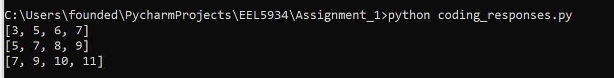
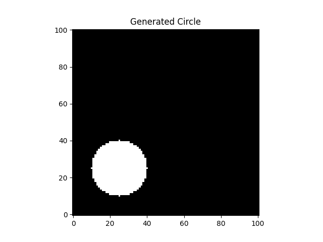
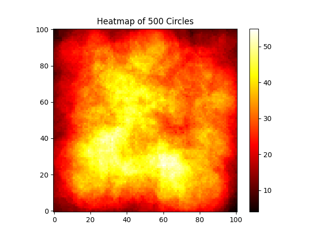

<h1 style="text-align: center">Assignment 1 Solutions</h1>

<b>EEL 5934   Joseph Cox (2752-2602)</b>

## Part 1: Interpreting lines of code
1. `mean(randn(1000,1))`
   1. The command `randn` generates an array of random numbers drawn from the normal
   distribution with size equal to the input size. In this case it creates a 1000x1 
   array of random numbers. The command `mean` returns the arithmetic mean of 
   the items in the inputted array along the first non-1-sized axis.
   2. The class of the output of this line is a 1x1 array of double-point precision 
   floating point values, the default type outputted by `randn` (preserved by 
   `mean`)
   3. The possible range of values returned by `randn` is *technically* 
   $$ (-\inf, \inf) $$, but numbers with large magnitude have near-zero chance of 
   being drawn.
   4. The mean is not expected to change whether you increase or decrease the number
   of values generated by `randn`. The mean is always expected to be 0. However, 
   with more values the mean is expected to be closer to the true mean by the law
   of large numbers.

2. `figure, imshow(imread('peppers.png')), title('Peppers!'), axis image, colorbar`
   1. I explain the function of each command below:
      1. `figure`: create a new figure. In MATLAB this creates a new popup window with
      the figure in it. 
      2. `imshow`: Draw the inputted array on the current figure as an image
      3. `imread`: Read the inputted filepath or array as an image. `imread` attempts
      to interpolate things like the number of channels and image format implicitly
      4. `title`: Title the current figure with the inputted string. This draws the 
      title above the current figure.
      5. `axis`: Set the axis limits according to the inputted array or style. In this
      case, using `image` as the style, each axis will have equal unit length and the
      axes are fitted as tight as possible to the data.
      6. `colorbar`: Display a vertical colorbar to the right on the current figure, 
      showing the current colormap and the mapping of values to that colormap.
   2. The class of the output of `imread('peppers.png')` is an array of 8-bit precision
   unsigned integers (assuming `peppers.png` is an 8-bit 3 channel png).
   3. The size of the output of `imread('peppers.png')` is 3xLxW, where L and W are
   the length and width of `peppers.png`, respectively in pixels.
3. `[2, 4, 5, 6] + [1, 3, 5]`
   1. The error message generated by the line is due to an attempt to add 2 matrices 
   of differing sizes: this behaviour is ill-defined since MATLAB cannot perform 
   element-wise addition on the two matrices.
   2. The answer to part b is found in the `coding_responses.py` file linked. The
   output is:
   

## Part 2: Defining Functions
The answers to part 2 are found in the accompanying Python file `coding_responses.py`.
Running this file requires an installation of Python with version 3.11 or later (though
it likely works with earlier versions of python), and `matplotlib` and `numpy` packages. 
The visual outputs are: 

